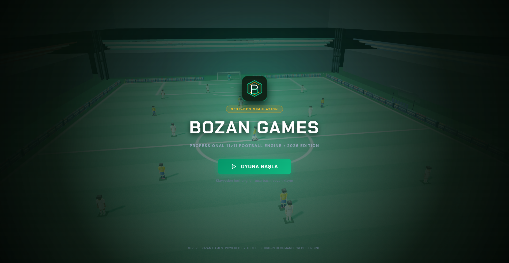
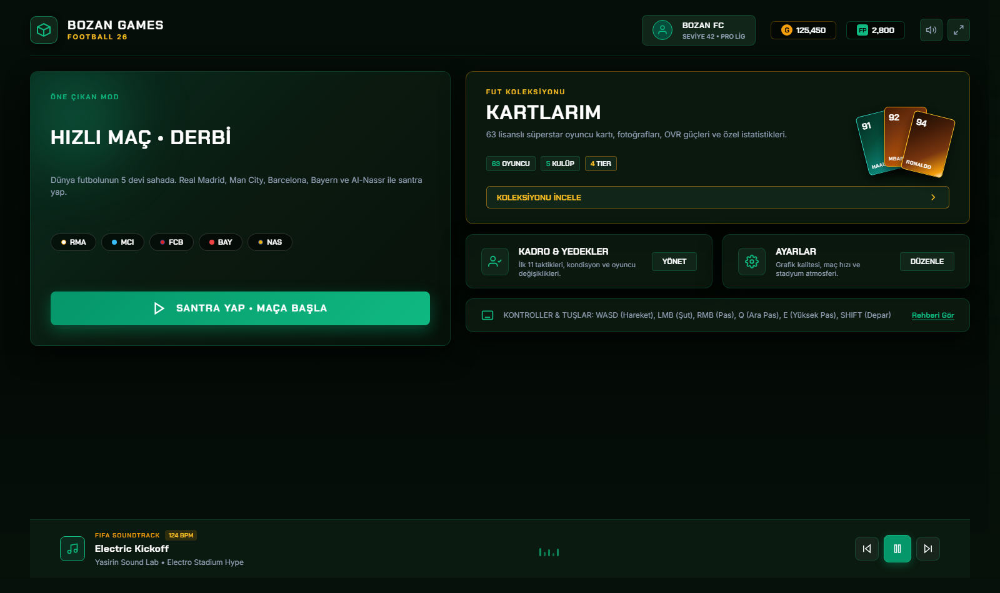
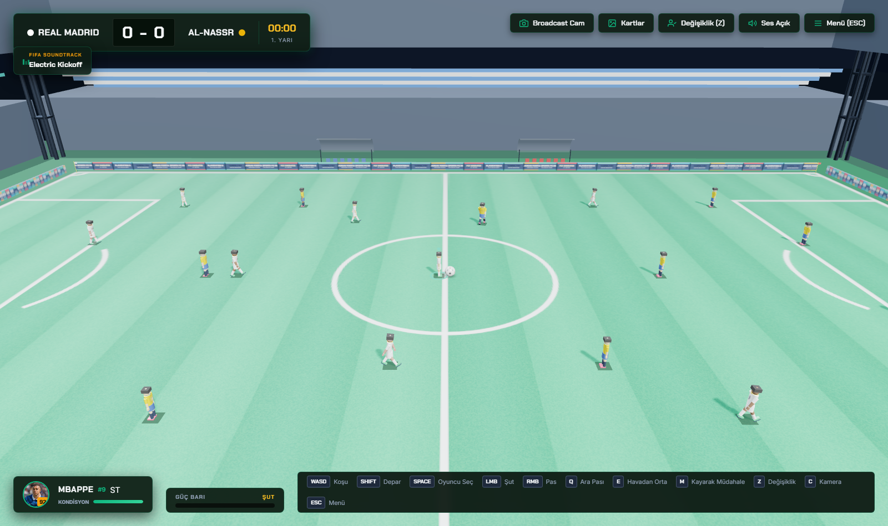
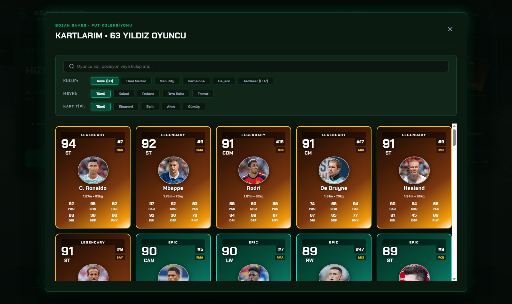
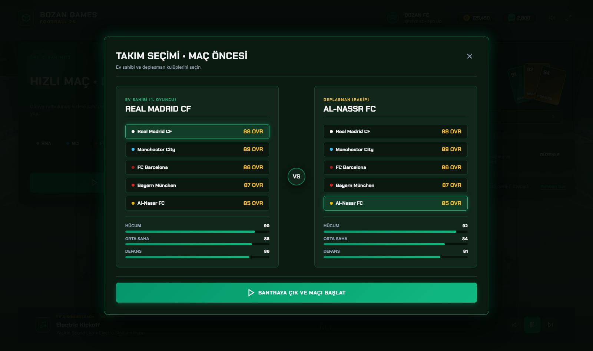
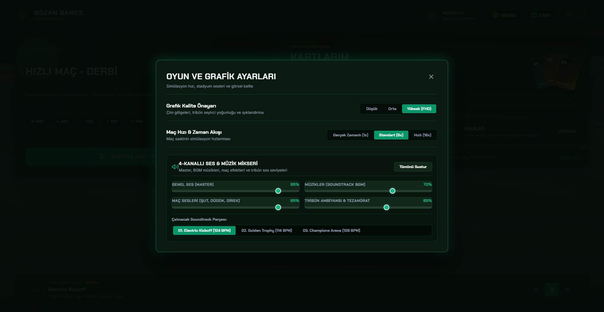

# ⚽ BOZAN GAMES - FIFA 2026 Simulation (Yasirin FIFA)

[](https://threejs.org/)
[](https://www.unrealengine.com/)
[](https://developer.mozilla.org/)
[]()

**BOZAN GAMES: Yasirin FIFA 2026**, hem tarayıcı üzerinde sıfır kurulumla çalışan yüksek performanslı **Three.js WebGL** 3D futbol simülasyonunu, hem de **Unreal Engine 5.5 C++** oyun mimarisi kaynak kodlarını içeren yeni nesil profesyonel bir 11v11 futbol projesidir.

---

## 📸 Ekran Görüntüleri & Önizleme

| Açılış Ekranı (Studio Splash) | Ana Menü & Kartlar |
| :---: | :---: |
|  |  |

| Maç İçi Oynanış & Yayın Kamerası | Oyuncu Kartları & İstatistikler |
| :---: | :---: |
|  |  |

| Takım Seçimi | Oyun İçi Ayarlar |
| :---: | :---: |
|  |  |

---

## 🌟 Öne Çıkan Özellikler

- **⚽ 11v11 Tam Saha Taktik Simülasyonu:** Gerçek saha ebatları, pozisyon alma kuralları, pres mekaniği, ofsayt ve yapay zeka kaleci kurtarışları.
- **🎯 Birleşik Güç Barı (Power Bar):** Şut, ara pası, orta ve paslarda basılı tutma süresine göre dinamik güç ve falso hesaplaması.
- **🧠 Gelişmiş Taktik Yapay Zeka:** Oyuncuların topa göre kademe alması, pas alternatifleri üretmesi, markaj ve hücum koşuları.
- **🎥 Çoklu Dinamik Kamera Açıları:** Yayın (Broadcast TV), Tele, Aksiyon (Action) ve Kale Arkası (End-to-End) kameraları arasında tek tuşla anında geçiş.
- **🎴 Lisanslı Oyuncu Kartları & Yüzler:** Real Madrid, Manchester City, Bayern Münih, Barcelona ve Al-Nassr kadroları; Kylian Mbappé, Erling Haaland, Jude Bellingham, Vinícius Jr., Cristiano Ronaldo, Arda Güler ve daha fazlası.
- **🗺️ Mini Harita / Radar & Taktik Değişiklik:** Saha üstü canlı 22 oyuncu radarı, oyuncu kondisyon barları (stamina), Z tuşu ile yedek kulübesi ve oyuncu değişikliği.
- **🔊 Gerçekçi Web Audio API Ses Sistemi:** Düdük sesleri, topa vuruş sesleri, dinamik stadyum ve taraftar tezahüratları.
- **⚡ UE5 C++ & Three.js Çift Mimari:** Oyun hem tarayıcıda doğrudan çalışabilir hem de UE5 C++ modülleriyle masaüstü Unreal Engine projesi olarak derlenebilir.

---

## 🎮 Kontroller & Oynanış Rehberi

| Eylem | Klavye Tuşu | Fare (Mouse) |
| :--- | :--- | :--- |
| **Hareket** | `W`, `A`, `S`, `D` veya `Ok Tuşları` | - |
| **Depar (Sprint)** | `Shift` (Basılı Tutun) | - |
| **Oyuncu Değiştirme** | `Boşluk (Space)` | - |
| **Şut / Güç Barı** | `K` (Basılı tutup bırakın) | `Sol Tık (LMB)` |
| **Yerden Pas** | `J` | `Sağ Tık (RMB)` |
| **Ara Pası (Through Ball)** | `Q` veya `L` | - |
| **Yüksek Orta (Cross)** | `E` | - |
| **Kayarak Müdahale** | `M` | - |
| **Oyuncu Değişikliği Menüsü** | `Z` | - |
| **Kamera Açısı Değiştirme** | `C` | - |
| **Ayarlar / Menü** | `ESC` | - |

---

## 🚀 Nasıl Başlatılır?

### Seçenek 1: Tek Tıkla Başlatma (Tavsiye Edilen)
Proje klasöründeki `start_game.bat` dosyasına çift tıklayın. Varsayılan tarayıcınızda oyun hemen başlayacaktır.

### Seçenek 2: Doğrudan Tarayıcıda Açma
`index.html` dosyasını Google Chrome, Microsoft Edge, Brave veya Mozilla Firefox gibi modern bir tarayıcıda açın.

### Seçenek 3: Yerel Sunucu ile Çalıştırma (Opsiyonel)
Node.js veya Python ile yerel HTTP sunucusu açmak için:
```bash
# Python 3 ile:
python -m http.server 8000

# veya Node.js npx serve ile:
npx serve .
```
Ardından tarayıcınızda `http://localhost:8000` adresine gidin.

---

## 📁 Proje Dosya Yapısı

```plaintext
├── assets/                    # Oyuncu fotoğrafları ve görsel varlıklar
│   └── players/               # 40+ gerçek futbolcu yüz portresi
├── Config/                    # Unreal Engine 5 yapılandırma dosyaları (DefaultEngine.ini vb.)
├── Source/                    # Unreal Engine 5 C++ kaynak kodları
│   └── YasirinFIFA/
│       ├── Public/            # FootballAI, FootballBall, Character, Stadium başlık dosyaları
│       └── Private/           # C++ oyun mantığı implementasyonları
├── scripts/                   # Yardımcı otomasyon ve veri güncelleme scriptleri
├── audio.js                   # Web Audio API stadyum/efekt motoru
├── game.js                    # Ana 3D Three.js fizik ve futbol oyun motoru (140KB+)
├── index.html                 # Modern UI arayüzü ve sahne katmanları
├── styles.css                 # Profesyonel UI, kart ve HUD stilleri
├── three.min.js               # Three.js 3D WebGL kütüphanesi
├── start_game.bat             # Hızlı başlatıcı batch dosyası
├── YasirinFIFA.uproject       # Unreal Engine 5 proje tanımlayıcısı
└── README.md                  # Proje dokümantasyonu
```

---

## 🛠️ Kullanılan Teknolojiler

- **Frontend & 3D:** Three.js (WebGL), HTML5 Canvas, Vanilla Modern JavaScript (ES6+), CSS3 Grid & Flexbox
- **Ses:** HTML5 Web Audio API (Sentetik düdük, top vuruş frekansı, stadyum ortamı)
- **Oyun Motoru Mimarisi:** Unreal Engine 5.5, C++, UMG, Enhanced Input
- **Tipografi:** Google Fonts (`Chakra Petch`, `Inter`)
- **İkonografi:** Vektörel SVG İkon Sistemi

---

## 👨‍💻 Geliştirici & Lisans

Geliştirici: **Yusuf Talha Bozan** ([@bozanlarolmasin1717](https://github.com/bozanlarolmasin1717))  
Proje: **BOZAN GAMES - FIFA 2026**  
Lisans: MIT Lisansı altında açık kaynak olarak sunulmuştur.
